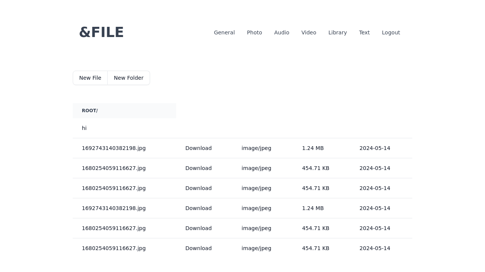

# FILE: A SvelteKit File Manager



This is a web-based file manager application built with SvelteKit, Tailwind CSS, and Firebase. It allows users to manage and view various file types, including photos, videos, audio, documents, and text files.

## Features

*   User authentication (login/register)
*   File and folder management
*   Viewers for different file types:
    *   Image gallery for photos
    *   Video player
    *   Audio player
    *   PDF and EPUB document viewer
    *   Markdown renderer for text files

## Getting Started

### Prerequisites

*   Node.js and npm installed.
*   A Firebase project set up for authentication and storage.

### Installation & Setup

1.  **Clone the repository:**
    ```bash
    git clone <repository-url>
    cd <project-directory>
    ```

2.  **Install dependencies:**
    ```bash
    npm install
    ```

3.  **Configure Firebase:**
    Create a `src/lib/firebaseConfig.js` file with your Firebase project's configuration.

4.  **Run the development server:**
    ```bash
    npm run dev
    ```
    The application will be available at `http://localhost:5173`.

## Available Scripts

*   `npm run dev`: Starts the development server.
*   `npm run build`: Builds the application for production.
*   `npm run preview`: Previews the production build.
*   `npm run test`: Runs both integration and unit tests.
*   `npm run test:e2e`: Runs end-to-end tests with Playwright.
*   `npm run lint`: Checks for formatting issues with Prettier.
*   `npm run format`: Formats the code with Prettier.